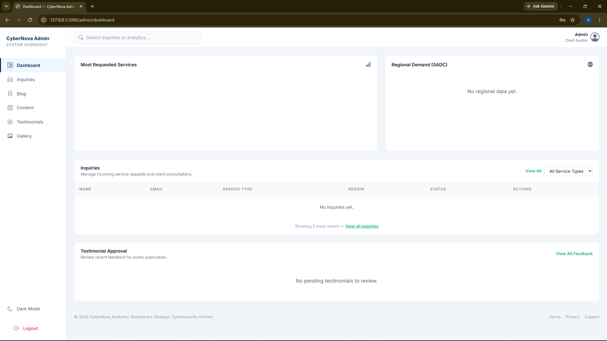

# CyberNova Analytics Website

A database-driven website for CyberNova Analytics, a cybersecurity company. Visitors can browse services, case studies and articles, leave testimonials, and submit security service requests. Staff manage everything through a password-protected admin panel.

Built as a university product development project (CET 333). It is a working prototype with a single admin account and no public user registration.

## Live Demo

**Site:** https://dube.pythonanywhere.com

**Admin panel:** https://dube.pythonanywhere.com/admin/login

| Username | Password              |
| -------- | --------------------- |
| `admin`  | `CyberNova-Demo-2026` |

This is a demo instance hosted on PythonAnywhere's free tier. Anyone can sign in to the admin panel, so please don't enter real personal information in the forms. Content may be edited or reset at any time, and the site may go offline when the free hosting expires.

## Design Documentation

Requirements, ERD, use case diagram, flowcharts and wireframes are in [docs/DESIGN.md](docs/DESIGN.md).

## Features

### Public site

- Cybersecurity solutions overview (e.g. AI Cyber Assistant, Network Security Audit, Penetration Testing)
- Case studies of previous threat mitigation projects
- Technical blog on cyber risks and security best practices
- Customer testimonials with 1 to 5 star ratings, plus a submission form
- Photo gallery of workshops and events
- **Contact Security Team** form (name, email, phone, organisation, country, job title, issue type, description) with server-side validation and an on-screen confirmation
- Responsive layout for desktop and mobile

### Admin panel

- Secure login with hashed passwords and session-based access
- View all submitted inquiries in full
- Filter inquiries by service type
- Dashboard analytics: most requested services and regional demand
- Approve or reject submitted testimonials
- Create, edit and publish blog posts
- Manage solutions, case studies and gallery images

## Tech Stack

- **Backend:** Python 3, Flask, Werkzeug (password hashing)
- **Database:** SQLite
- **Frontend:** HTML, CSS, JavaScript, Bootstrap, Jinja2 templates
- **Configuration:** python-dotenv

## Project Structure

```
CyberNova/
├── app.py              # Flask app and routes
├── models.py           # Database setup (init_db)
├── seed.py             # Creates the admin account
├── requirements.txt    # Python dependencies
├── .env.example        # Template for environment variables
├── templates/          # Jinja2 HTML templates
└── static/             # CSS, JS, images
```

## Getting Started

### 1. Clone the repository

```bash
git clone https://github.com/YOUR-USERNAME/CyberNova.git
cd CyberNova
```

### 2. Create and activate a virtual environment

```bash
python -m venv venv
venv\Scripts\activate        # Windows
source venv/bin/activate     # Mac/Linux
```

### 3. Install dependencies

```bash
pip install -r requirements.txt
```

### 4. Configure environment variables

```bash
copy .env.example .env       # Windows
cp .env.example .env         # Mac/Linux
```

Open `.env` and replace every `change-me` with your own values:

| Variable         | Description                                                                                                       |
| ---------------- | ----------------------------------------------------------------------------------------------------------------- |
| `SECRET_KEY`     | Random string used to sign sessions. Generate one with `python -c "import secrets; print(secrets.token_hex(32))"` |
| `ADMIN_USERNAME` | Username for the admin account                                                                                    |
| `ADMIN_PASSWORD` | Password for the admin account (choose a strong one)                                                              |
| `FLASK_DEBUG`    | `1` for development, `0` otherwise                                                                                |

### 5. Create the database and admin account

```bash
python app.py     # creates the tables on first run; stop with Ctrl+C
python seed.py    # creates the admin account from your .env values
python seed_demo.py # optional sample content
```

### 6. Run the app

```bash
python app.py
```

Open http://127.0.0.1:5000 in your browser. The admin panel is at `/admin/login`.

> The admin account is only created once. If you change `ADMIN_PASSWORD` later, delete `database.db` and run the seed again, or update the password hash directly.

## Screenshots




## Future Improvements

- Export inquiry data to CSV
- Email notification when a new inquiry is submitted

## Author

Thabang Dube
BSc (Hons) Computer Systems Engineering
[dubebotho22@gmail.com]

## License

[ "For academic purposes only"]
